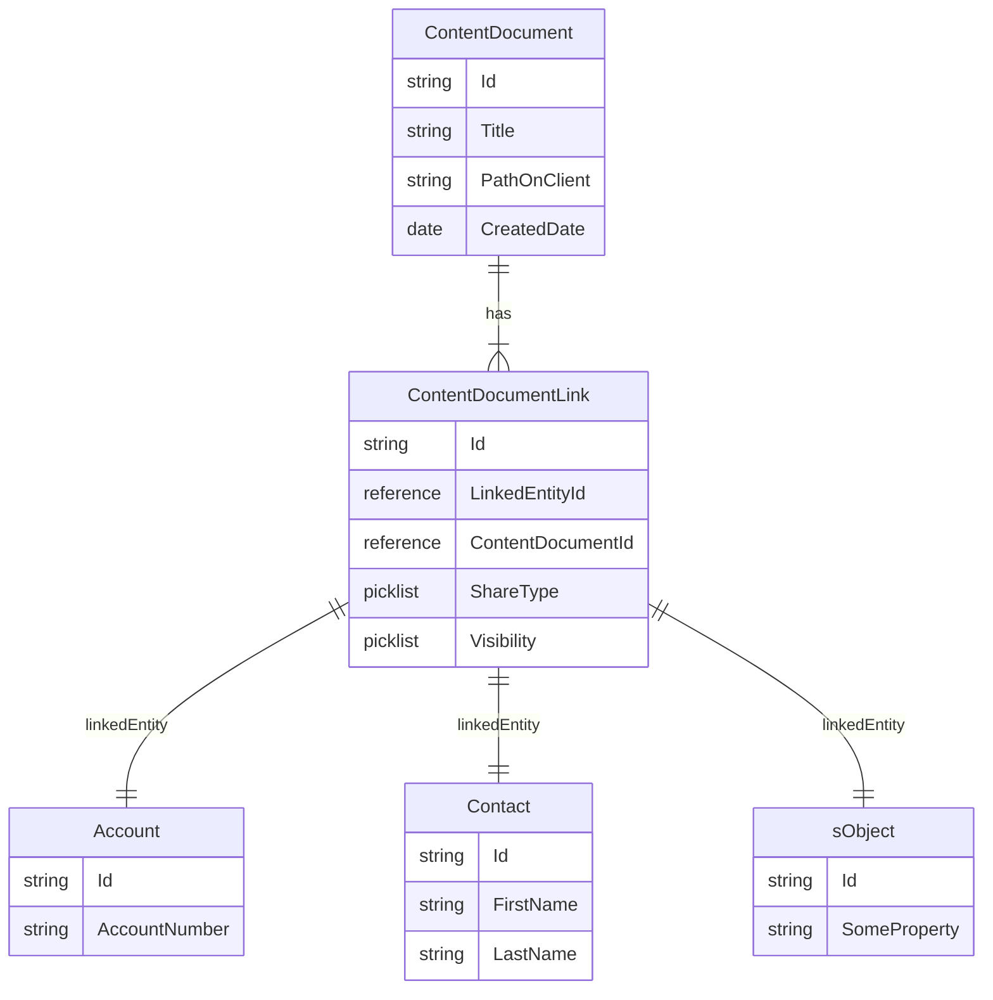
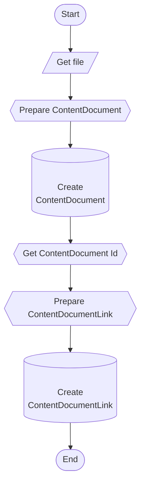

This question comes up occasionally in my conversations with customers. Often there is a need to programmatically upload an attachment (a pdf or an image) file to Salesforce using MuleSoft. If the integration developer is not very familiar with the Salesforce Platform, it usually confusing due to the way Salesforce manages the attachments.

As shown in the following ER diagram, there are multiple entities involved in storing and managing the attachments in Salesforce

Things to note:

- Salesforce attachments are stored in ContentDocument (and ContentVersion) objects.
  - The ContentDocument object is used to retrieve, query, update and delete the latest version of a document. 
  - The ContentVersion object is used to create, query, retrieve, search, edit, and update a specific version of a Salesforce CRM Content document.
- The attachment is stored in ContentDocument (Or ContentVersion) and linked to any sObject (Contact, Account etc) via ContentDocumentLink Object
- Thus, to successfully upload an attachment to Salesforce following needs to happen
  - Upsert an attachment (file) to ContentDocument/ContentVersion object
  - Query the ContentDocument/ContentVersion to get the ContentDocumentId
  - Use the ContentDocumentId to link to your sObject (Account, Lead Opportunity, etc) by upserting the relationship in the ContentDocumentLink object

Following flow chart shows the general approach to upload an attachment to Salesforce: 


Mule DSL code to achieve this
```

    <sub-flow name="Upload Attachment">
        <ee:transform 
            doc:name="Prepare ContentDocument">
            <ee:message>
            <ee:set-payload>
            <![CDATA[%dw 2.0
                output application/java
                ---
                [
                    {
                        Title: "filename" //Replace this with actual filename,
                        PathOnClient: "filename" //Replace this with the path on storage system
                        VersionData: payload.content as Binary {class: "byte[]"}
                        //This is the attachment content
                    }
                ]
                ]]>
            </ee:set-payload>
            </ee:message>
        </ee:transform>
        <salesforce:create type="ContentVersion"
            doc:name="Create ContentDocument"
            config-ref="Salesforce_Config"/>
        <ee:transform doc:name="Get Attachment Id">
            <ee:variables>
                <ee:set-variable variableName="contentVersionId">
                    <![CDATA[%dw 2.0
                    output application/java
                    ---
                    payload[0].id
                    ]]>
                </ee:set-variable>
            </ee:variables>
        </ee:transform>
        <salesforce:query 
            doc:name="Get ContentDocumentId"
            config-ref="Salesforce_Config">
            <salesforce:salesforce-query>
                SELECT ContentDocumentId From ContentVersion Where Id = ':contentVersionId'
            </salesforce:salesforce-query>
            <salesforce:parameters>
            <![CDATA[#[
                output application/java
                ---
                {
                    "contentVersionId" : vars.contentVersionId
                }
            ]
            ]]>
            </salesforce:parameters>
        </salesforce:query>
        <ee:transform doc:name="Prepare ContentDocumentLink">
            <ee:message>
                <ee:set-payload>
                    <![CDATA[%dw 2.0
                    output application/java
                    ---
                    [
                        {
                            LinkedEntityId: vars.accountId,
                            ContentDocumentId: payload[0].ContentDocumentId,
                            ShareType: "I"
                        }
                    ]
                    ]]>
                </ee:set-payload>
            </ee:message>
        </ee:transform>
        <salesforce:create 
            doc:name="Create ContentDocumentLink"
            config-ref="Salesforce_Config"
            type="ContentDocumentLink" />
    </sub-flow>

```

With this approach you can easily upload attachments to Salesforce.
 


